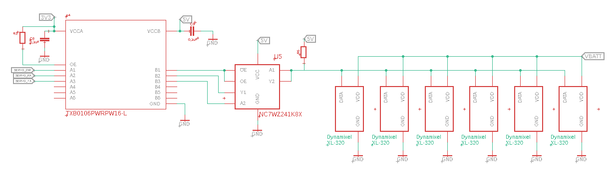

# Dynamixel2Espressif

This is an espressif port of the [Dynamixel2Arduino](https://github.com/ROBOTIS-GIT/Dynamixel2Arduino) Dynamixel library. 

## Using the component

Run the following command in your ESP-IDF project to install this component from the espressif component registry:

```bash
idf.py add-dependency "hansj66/dynamixel2espressif"
```

Or - add the following to your idf_component.yml to define a dependency to the github repository

```bash
dependencies:
	dynamixel2espressif:
		path: dynamixel2espressif.git
		git: ssh://git@github.com:hansj66/dynamixel2espressif.git
```

To run an example, create it as follows:

```bash
idf.py create-project-from-example "hansj66/dynamixel2espressif:<example name>"
```

Example: If you want to create a project based on the "ping" example:

```bash
idf.py create-project-from-example "hansj66/dynamixel2espressif:ping"
```

The default pinout is:

* TX_PIN=17
* RX_PIN=16
* DIR_PIN=23

To change the default pinout:
```bash
idf.py menuconfig
```
And then navigate to the menu "Dynamixel 2 Espressif configuration" to customize the pinout to your application.

## Examples

Examples beyond the "ping" and "position" examples can be found in the original [Dynamixel2Arduino](https://github.com/ROBOTIS-GIT/Dynamixel2Arduino) repository. The syntax is identical with the espressif version, except for the constructor.

## License

This component is provided under Apache 2.0 license, see LICENSE file for details.

## Hardware

This library has been tested with Dynamixel XL-320 and Dynamixel AX-12 servos. These are all using half duplex protocol.

The DIR_PIN is not necessary if using RS-485 servos (RS-485 is currently not tested).

### Test setup



This schematic shows a section of the schematic for a PCB with 6 physical ports (Since the servos are normally daisy chained, you can get away with having only having one physical port).

Since the ESP32 is a 3.3V device and the servos use 5V logic, we have to add a level shifter between the ESP and the dynamixel bus. 

The level shifter controls the [NC7WZ241](https://no.mouser.com/datasheet/2/308/1/NC7WZ241_D-2316814.pdf)/[74LVC2G241](https://www.ti.com/lit/ds/symlink/sn74lvc2g241.pdf?ts=1714724910252&ref_url=http%253A%252F%252Ffocus.ti.com%252Flit%252Fgpn%252Fsn74lvc2g241) buffer which in turn controls the bus. The port handler pulls the SERVO_DIR pin high before transmission and then pulls it low after transmission, to enable reception of status packets from the servos.

Please refer to the The [Dynamixel 2.0 protocol](https://emanual.robotis.com/docs/en/dxl/protocol2/) in the ROBOTIS e-manual for details.
